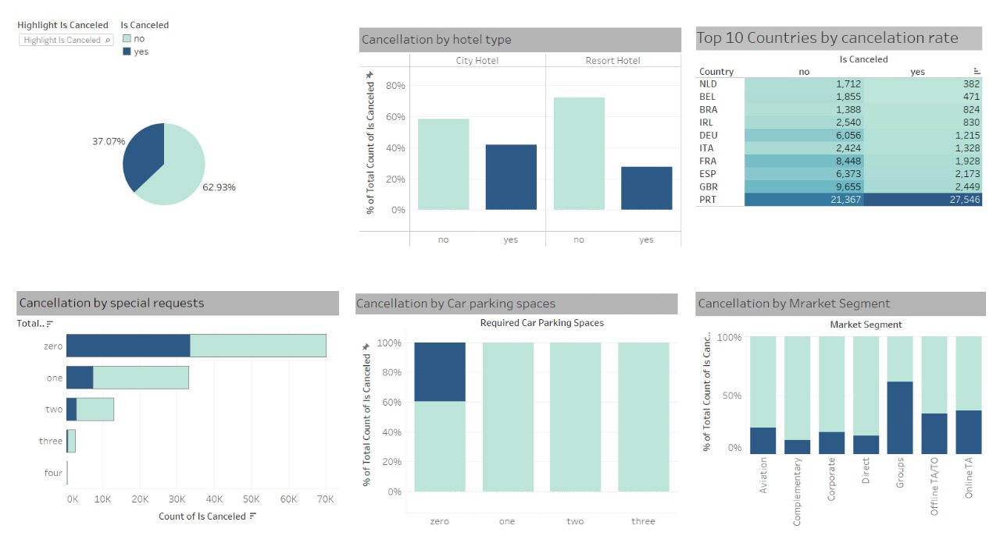

# Hotel Booking Cancellation Analysis

## Project Overview

This project analyzes hotel booking cancellation rates between a City Hotel and a Resort Hotel. By examining various factors influencing revenue generation and booking cancellations, the study aims to provide insights into the hospitality industry's operational challenges and customer behavior.

## Key Objectives

- **Examine Cancellation Rates**: Analyze cancellation rates at City Hotel and Resort Hotel to understand trends and patterns.
- **Identify Key Factors**: Explore factors influencing hotel booking cancellations, including non-business-related variables.
- **Create Visual Dashboard**: Develop a visual dashboard using Tableau to effectively present findings and insights.

## Methodology

1. **Data Extraction**: Utilized data from hotel booking records obtained from historical data sources.
   
2. **Data Analysis**: Conducted exploratory data analysis (EDA) to identify correlations and trends between variables affecting cancellation rates.
   
3. **Statistical Modeling**: Employed statistical techniques to quantify the impact of various factors on booking cancellations.
   
4. **Visualization**: Developed interactive visualizations and a comprehensive dashboard using Tableau for clear and concise communication of insights.

## Findings

- **Cancellation Trends**: Identified seasonal variations and booking patterns affecting cancellation rates.
- **Key Influencing Factors**: Highlighted the impact of non-business-related variables (e.g., customer demographics, booking channels) on cancellation rates.
- **Revenue Insights**: Provided recommendations for revenue management strategies based on cancellation analysis.

## Dashboard Preview

